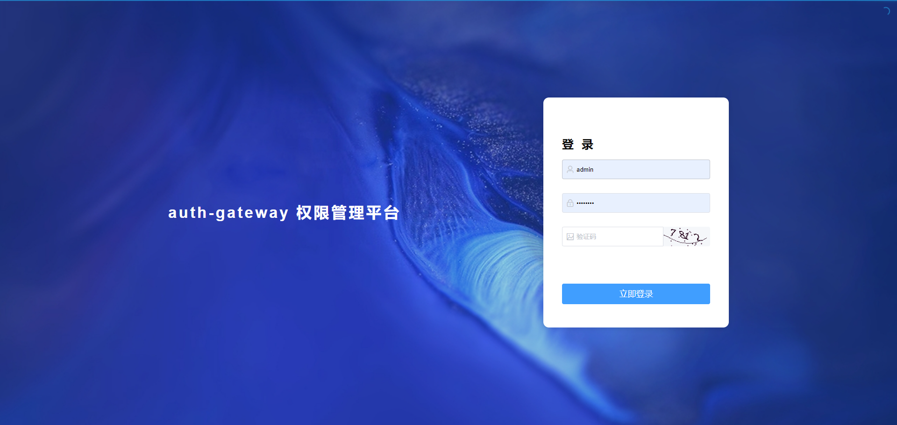
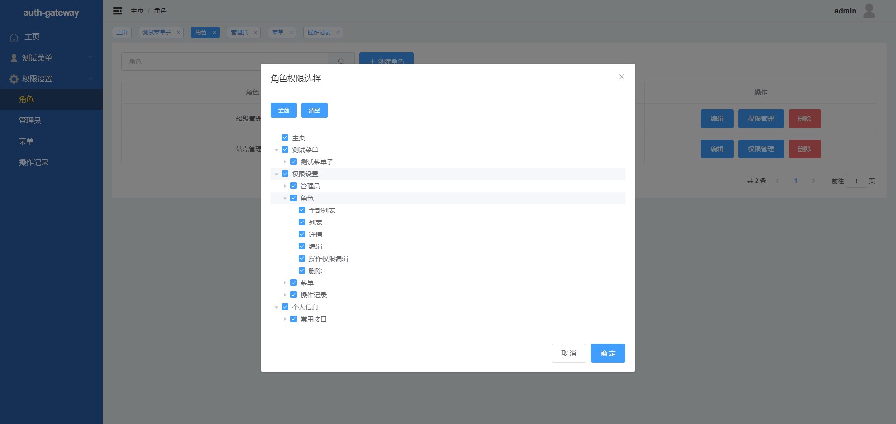

# auth-gateway

#### 介绍

auth gateway

登录、权限认证 http 网关

附带后台 RBAC 权限管理接口

验证通过后 通过 http 反向代理方式请求后端服务

admin.sql 是数据库文件

config.yml 是配置文件，填写所需代理的后端地址

1.管理员模块
2.登录模块
3.token验证模块
4.图形验证码

形如 http://0.0.0.0:3000/admin/xxx 不可用（网关管理模块）
/admin 网关管理模块
/html 前端页面打包地址模块
其他地址可用

没有被注册的路由地址会走反向代理

在界面中设置需要验证的权限（菜单-权限，角色-勾选权限-点击确定）

#### 软件架构
gin + gorm + mysql

#### 安装教程
git clone https://gitee.com/lluck42/auth-gateway

导入 admin.sql

mv config-demo.yml config.yml

配置 config.yml 配置文件，填入 mysql 账号密码，需要反向代理的协议、地址

go run .

打开网关配置界面进行配置

http://127.0.0.1:3000/html

账号 admin 密码 Admin123

备注：header 中有 adminID 可用于业务

#### 获取接口权限
1.前端调用 login 接口登录成功后获取 token
2.在http请求 header 中加入 Bearer token 即可
3.具体步骤：需要先调用获取验证码接口获取验证码ID，显示出验证码，然后再调用登录接口进行登录（接口在登录界面，请自行寻找哈）

备注：header 中有 adminID 可用于业务
